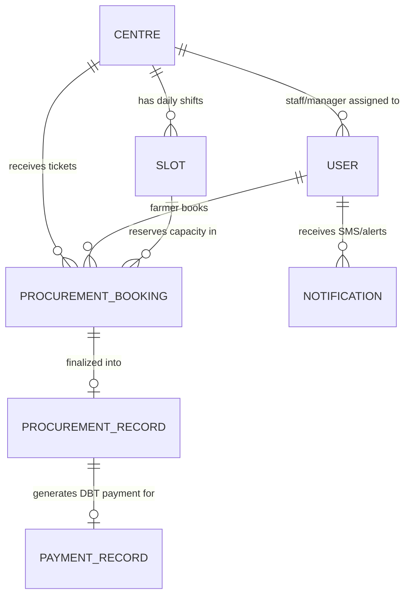

# 🌾 AgriQueue (KisanSetu) — Database Architecture & Professor Presentation Guide

> **Project Title:** Smart Agricultural Procurement Slot Scheduling & Live Queue Serialization Platform  
> **Department:** Department of Consumer Affairs, Ministry of Consumer Affairs, Food & Public Distribution (Govt. of India)  
> **Tech Stack:** Node.js, Express, MongoDB (Mongoose ODM), Socket.IO, React 18, Leaflet, TailwindCSS

---

## 🎯 1. The Core Problem & Our Solution (Explain This First)

### The Real-World Problem at Mandis
* **Uncontrolled Chaos:** Farmers currently arrive unannounced at government mandi procurement centers with tractor-trolleys, causing traffic jams extending 3–5 km.
* **12–24 Hour Idle Waiting:** Farmers stand in harsh heat/rain without knowing when their grain will be inspected or weighed.
* **Middlemen Exploitation:** Lack of transparent queue numbering allows middlemen to jump the line or purchase grain below MSP.
* **Delayed Payments:** Manual paperwork delays MSP DBT (Direct Benefit Transfer) bank disbursement by weeks.

### Our Solution Architecture (4-Stage Pipeline)
1. **Digital Slot Booking:** Farmers book an 8:00–10:00, 10:00–12:00, etc., appointment window online or via helpline before leaving their village.
2. **Gate QR Check-In:** Upon arrival, the gate staff scans the farmer's digital token ticket pass to confirm physical arrival and enter them into the verified queue line.
3. **Automated Live Queue & Loudspeaker Call:** High-contrast LED boards, Socket.IO live streaming, and regional SMS alerts call farmers to the inspection counter strictly by token order.
4. **Electronic Weighbridge & Instant DBT Sign-off:** Automated moisture testing, official MSP quality grading, weight capture, and 1-click manager approval for direct bank transfer via PFMS.

---

## 📊 2. Database Collections & Schema Architecture

AgriQueue uses a structured MongoDB relational document model designed for high-concurrency mandi operations:

### Collection 1: `Centres` (`Centre.js`)
Stores official government APMC mandi procurement centers across India with real GPS coordinates.
* **Key Fields:**
  * `name`: Official mandi name (e.g. *Karnal Anaj Mandi Procurement Centre*)
  * `code`: Unique uppercase code (e.g. `KNL01`, `MRT01`, `KOT01`)
  * `state`, `district`, `address`, `contactPhone`
  * `location`: `{ latitude: 29.6857, longitude: 76.9905 }` (Used by our interactive Leaflet map)
  * `dailyCapacityQuintals`: Mandi daily grain intake limit (e.g., 800–1300 Qtl)
  * `supportedCrops`: Regional MSP crops (`Wheat`, `Paddy`, `Mustard`, `Chana`, `Soyabean`, `Cotton`, etc.)

---

### Collection 2: `Slots` (`Slot.js`)
Manages shift-based capacity allocation per centre per day to eliminate crowding.
* **Key Fields:**
  * `centreId`: Reference to Centre
  * `date`: Target procurement date (`YYYY-MM-DD`)
  * `startTime` / `endTime`: e.g. `08:00 - 10:00`, `10:00 - 12:00`, `12:00 - 14:00`, `14:00 - 16:00`
  * `maxCapacityQuintals`: Maximum grain weight permitted for this window (e.g., 250 Qtl)
  * `bookedCapacityQuintals`: Currently reserved grain weight
  * `maxFarmers`: Cap on simultaneous tractor tokens (e.g., 15 farmers per shift)
  * `bookedFarmers`: Real-time counter of booked appointments

---

### Collection 3: `Users` (`User.js`)
Role-Based Access Control (RBAC) supporting 4 distinct user roles:
1. `farmer`: Books slots, receives SMS alerts, tracks live queue, checks DBT status.
2. `staff`: Verifies gate QR check-in, calls tokens to counter, records weighbridge scales.
3. `manager`: Oversees centre throughput, capacity, and signs off on DBT payments.
4. `admin` / `govt_admin`: National directorate overseeing all state mandis and macro analytics.
* **Key Fields:**
  * `name`, `phone` (used for login & SMS alerts), `password` (bcrypt hashed), `role`, `preferredLanguage` (`hi`, `en`, `pa`, `gu`, `mr`)
  * `farmerDetails`: `{ aadhaarNumber, landAreaAcres, village, district, bankDetails: { accountName, accountNumber, ifscCode, bankName } }`

---

### Collection 4: `ProcurementBookings` (`ProcurementBooking.js`) — **The Heart of the Queue**
Represents a farmer's live digital token pass.
* **Token Serial Format:** `TOK-<CENTRE_CODE>-<YYYYMMDD>-<SEQ>` (e.g., `TOK-KNL01-20260911-002`)
* **5-Stage Queue State Machine:**
  * `booked`: Appointment confirmed online. Awaiting physical arrival at mandi gate.
  * `checked_in`: Farmer has scanned QR at gate. Actively in the physical queue lineup.
  * `in_inspection`: Token actively called to Counter 1 for moisture/quality inspection.
  * `weighment_completed`: Grain weighed on electronic weighbridge; slip generated.
  * `completed`: DBT payment disbursed to farmer's bank account.

---

### Collection 5: `ProcurementRecords` (`ProcurementRecord.js`)
Official MSP procurement certificate recorded at the weighbridge.
* **Key Fields:**
  * `bookingId`, `farmerId`, `centreId`, `staffId`
  * `actualQuantityQuintals`: Scale weight (Gross - Tare)
  * `qualityGrade`: `Grade A` (FAQ - 100% MSP), `Grade B` (5% deduction), `Grade C` (15% deduction), `Rejected`
  * `moisturePercentage`: Grain moisture content (MSP ceiling: 12.0%)
  * `mspPricePerQuintal`: Official government rate (e.g., ₹2,275/Qtl for Wheat)
  * `totalAmount`: Auto-calculated total payment (Actual Qty × MSP Rate − Quality Deductions)
  * `weighmentDetails`: `{ grossWeightKg, tareWeightKg, netWeightKg, bagCount }`

---

### Collection 6: `PaymentRecords` (`PaymentRecord.js`)
Direct Benefit Transfer (DBT) and Public Financial Management System (PFMS) ledger.
* **Key Fields:**
  * `procurementRecordId`, `farmerId`, `centreId`, `amount`
  * `status`: `pending_approval` ➔ `approved` ➔ `processed` / `paid`
  * `bankDetails`: Farmer's verified bank account and IFSC code
  * `paymentReference`: PFMS transaction ID (e.g., `DBT-PFMS-98214512`)
  * `approvedBy`: Manager user ID & timestamp

---

## 🚀 3. Step-by-Step Live Demo Script for Your Professor

Follow these exact steps to demonstrate the end-to-end flow in 3 minutes:

### Step 1: Show the Home Page Interactive Map (30 seconds)
1. Navigate to `http://localhost:3000`.
2. Scroll to **"Mandi Centres Across India"**.
3. **Explain:** *"Professor, we have integrated an interactive OpenStreetMap containing 10 major APMC hubs across 9 states with real GPS coordinates. Clicking any red marker shows the centre's daily capacity and supported crops."*

---

### Step 2: Show the Live Queue Board as Farmer Suresh Patel (1 minute)
1. Log in as farmer: **Phone: `9876543211` / Password: `password123`**.
2. Click **"Live Centre Queue"** in the sidebar.
3. **Show Your Screen:**
   * **Now Serving:** Token `#001` (Rameshwar Farmer) is actively at Counter 1.
   * **Checked-In & Waiting:** Notice `#002` (Suresh Patel) highlighted with a prominent **`YOUR TOKEN`** badge right at the top of the waiting line!
   * **Upcoming:** 3 farmers scheduled for afternoon shifts.
   * **Completed:** 2 farmers already finished with verified weighment slips.
4. **Explain:** *"The farmer knows exactly how many tractors are ahead of him, eliminating anxious waiting."*

---

### Step 3: Switch to Staff Portal & Call Next Farmer (45 seconds)
1. Open an incognito tab or log in as Karnal Staff: **Phone: `7777777777` / Password: `password123`**.
2. Go to **"Call Next Farmer"** or **"Today's Queue Roster"**.
3. Click the big **"CALL NEXT"** broadcast button.
4. **Explain:** *"When staff presses 'Call Next', Socket.IO instantly broadcasts to all screens, updates the digital display board, and sends an automated SMS to the farmer's mobile phone."*

---

### Step 4: Switch to Manager Portal & Disburse DBT Payment (45 seconds)
1. Log in as Karnal Manager: **Phone: `8888888888` / Password: `password123`**.
2. Navigate to **"DBT Payment Approvals"**.
3. Show the pending weighment ticket for `₹147,875`.
4. Click **"Approve Payment"** then **"Disburse Bank DBT"**.
5. **Explain:** *"The centre manager verifies quality certificates and digitally signs off the payment directly into the farmer's bank account via PFMS DBT with an immutable reference ID."*

---

## 🔑 4. Evaluation Demo Account Credentials Table

| Role | Name | Phone Number | Password | Centre / Region |
| :--- | :--- | :--- | :--- | :--- |
| **Govt Admin** | Dr. Rajesh Sharma | `9999999999` | `password123` | National Directorate |
| **Centre Manager** | Sardar Gurdeep Singh | `8888888888` | `password123` | Karnal Anaj Mandi (Haryana) |
| **Centre Staff** | Vikas Kumar | `7777777777` | `password123` | Karnal Anaj Mandi (Haryana) |
| **Farmer (Demo 1)** | Suresh Patel | `9876543211` | `password123` | Active #1 in Waiting Queue |
| **Farmer (Demo 2)** | Rameshwar Farmer | `9876543210` | `password123` | Currently Serving at Counter |
| **Manager (UP)** | Rakesh Verma | `8888888881` | `password123` | Meerut APMC (Uttar Pradesh) |
| **Staff (UP)** | Anil Tyagi | `7777777771` | `password123` | Meerut APMC (Uttar Pradesh) |
| **Manager (RJ)** | Mahendra Singh Meena | `8888888882` | `password123` | Kota Krishi Mandi (Rajasthan) |
| **Staff (RJ)** | Pooja Sharma | `7777777772` | `password123` | Kota Krishi Mandi (Rajasthan) |
| **Manager (GJ)** | Bhavin Patel | `8888888883` | `password123` | Rajkot APMC (Gujarat) |
| **Staff (GJ)** | Ketan Vaghani | `7777777773` | `password123` | Rajkot APMC (Gujarat) |
