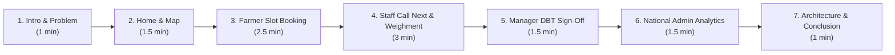

# 🌾 AgriQueue (KisanSetu) — Complete Professor Presentation Guide & Live Demo Workflow

> **Platform:** Smart MSP Agricultural Procurement Slot Scheduling & Live Queue Serialization System  
> **Ministry:** Department of Consumer Affairs, Ministry of Consumer Affairs, Food & Public Distribution (Govt. of India)  
> **Tech Stack:** React 18, Vite, TailwindCSS, Node.js, Express, MongoDB (Mongoose), Socket.IO, Leaflet OpenStreetMap  

---

## ⏱️ Executive Presentation Summary (10–12 Minute Live Demo Plan)

---

## 🔑 Demo Login Credentials Cheat Sheet

| Role | Name | Phone | Password | Key Showcase |
| :--- | :--- | :--- | :--- | :--- |
| **Farmer** | Suresh Patel | `9876543211` | `password123` | Active token `#002`, slot booking (`/book-slot`) with 5-farmer capacity limit |
| **Centre Staff** | Vikas Kumar | `7777777777` | `password123` | Call Next Farmer (`/dashboard/call-next`), MSP Entry (`/dashboard/procurement-entry`) |
| **Mandi Manager**| Amarjit Singh| `8888888888` | `password123` | Live queue monitoring, 1-click DBT MSP payment approval |
| **Govt Admin** | Dr. P. K. Sharma | `9999999999` | `password123` | National procurement dashboard, state-wise analytics, MSP disbursements |

---

## 🎬 Step-by-Step Live Demonstration Script

### ACT 1: The Problem & The Public Portal (Where to Start)
* **Goal:** Hook the professor immediately by contrasting real-world mandi chaos with your automated solution.
* **URL:** `http://localhost:3000/`
* **What to Show & Say:**
  1. **The Hook:**
     > *"Respected Professor, in India today, when procurement season begins, thousands of farmers bring tractor-trolleys to APMC mandis unannounced. They wait 18 to 24 hours in line in extreme weather, creating 5-kilometer traffic jams, while corrupt middlemen exploit the chaos. Our project, **AgriQueue (KisanSetu)**, provides an end-to-end digital solution from field appointment to direct bank credit."*
  2. **Official Branding & Multilingual Interface:**
     - Toggle between **English** and **हिन्दी** in the top header.
     - Show how all buttons, tokens, and navigation adapt instantly to rural linguistic requirements.
  3. **Real-time Live Queuing Status Board (Directly on Home Page):**
     - Scroll to the **Live Queuing Status Board** section on the Home page.
     - Point out the **Currently Serving Token** (`TOK-KNL01-20260911-001`), farmer name, crop, and the 4 live metrics:
       - **Total Booked Today**
       - **Checked-In & Waiting**
       - **Completed Today** (Explain that this counter updates in real time via Socket.IO whenever staff completes an inspection!)
  4. **Interactive GIS Map Across India:**
     - Scroll down to the **Mandi Centres Across India Map** powered by Leaflet & OpenStreetMap.
     - Click markers across states (Karnal - Haryana, Meerut - UP, Kota - Rajasthan, Rajkot - Gujarat, Nashik - Maharashtra, Indore - MP, Patna - Bihar).
     - Show that each mandi shows its real GPS coordinates, daily capacity, and supported MSP crops.

---

### ACT 2: Public Live Queue Board for Mandi Displays
* **Goal:** Show how farmers waiting at the mandi know their exact turn without crowding the counter.
* **URL:** Click **"View Live Queue Status"** or navigate to `http://localhost:3000/live-queue`.
* **What to Show & Say:**
  - *"This page is designed for high-visibility TV displays installed at the mandi gate and waiting sheds."*
  - Point out the large **Now Serving Token** display.
  - Show the three synchronized columns:
    1. **Checked-In & Waiting** (Active queue order)
    2. **Upcoming Booked Tokens** (Farmers arriving later in today's shifts)
    3. **Completed Today** (Successfully inspected and weighed today)

---

### ACT 3: Farmer Experience — Slot Booking with 5-Farmer Limit
* **Goal:** Demonstrate how a farmer books a slot before leaving home and how the capacity system prevents overcrowding.
* **Action:**
  1. Click **Sign In** (`http://localhost:3000/login`).
  2. Enter Phone: `9876543211`, Password: `password123` (Farmer Suresh Patel).
  3. You land on the **Farmer Dashboard** (`/dashboard`).
* **What to Show & Say:**
  1. **Farmer Overview:**
     - Point out the welcome banner *"Namaste, Suresh Patel!"*
     - Point out the highlighted **Active Token Pass** (`TOK-KNL01-20260911-002`) showing his position in the queue.
  2. **Redirect to Slot Booking:**
     - Click the prominent red button: **"Book Procurement Slot"**.
     - Notice how it immediately redirects directly to `http://localhost:3000/book-slot`.
  3. **Capacity Enforcement (Highlight Feature):**
     - Select a date and centre.
     - Point out the slot capacity indicators:
       - *"Notice how each time slot strictly enforces a maximum capacity of **5 farmers**."*
       - Slot 1 (`08:00 - 10:00`): Marked in red **`FULL (5/5)`** with badge `⛔ Time zone booked. No other farmer can register.` and is disabled from clicking!
       - Slot 2 (`10:00 - 12:00`) & Slot 3 (`12:00 - 14:00`): Show live counters like `1 / 5 Booked` (4 available).
       - Slot 4 (`14:00 - 16:00`): Shows `0 / 5 Booked` (freshly open).
  4. **Book a Fresh Slot:**
     - Select Crop: `Wheat` or `Mustard`, enter Quantity `45` Qtl, and select an available slot.
     - Click **"Confirm Slot Booking"**.
     - The system generates a digital token, increments the slot counter (e.g. 0 &rarr; 1), and dispatches a confirmation SMS!

---

### ACT 4: Mandi Centre Staff Operations (Inspection & Weighbridge)
* **Goal:** Show how mandi staff operates without manual paperwork or favoritism.
* **Action:**
  1. Log out and log in as Centre Staff: Phone `7777777777`, Password `password123` (Quality Inspector Vikas Kumar).
* **What to Show & Say:**
  1. **Call Next Farmer (`/dashboard/call-next`):**
     - Open sidebar &rarr; click **Call Next Farmer**.
     - Show the **"Now Serving at Counter"** box and the **"Next In Line"** box showing who is waiting.
     - Click the large red **CALL NEXT** button!
     - Highlight:
       - Instant green alert: *"Success! Called Token TOK-KNL01-20260911-002 (Suresh Patel)"*.
       - Audio/SMS gateway broadcast.
       - The previous farmer is automatically transitioned to completed, immediately updating the **"Completed Today"** counter!
  2. **Procurement Entry Screen (`/dashboard/procurement-entry`):**
     - Open sidebar &rarr; click **Procurement Entry Screen**.
     - Show the dropdown showing all active tickets at the centre today.
     - Select or enter `TOK-KNL01-20260911-002`.
     - Enter actual weighment: `45` Quintals.
     - Select Quality Grade: Show that choosing **Grade A** keeps 100% MSP (₹2,275/Qtl), **Grade B** applies a 5% moisture deduction, and **Grade C** applies a 15% deduction.
     - Notice the **Auto-Calculated Total Payable MSP Amount** (e.g. ₹1,02,375).
     - Click **"Finalize & Mark Procurement Completed"**.
     - Show the green success message: Ticket is marked `COMPLETED` and an electronic payment record is created for DBT transfer!

---

### ACT 5: Mandi Manager Payment Sign-off (1-Click DBT)
* **Goal:** Show the supervisory approval flow ensuring zero fund leakage.
* **Action:**
  1. Log in as Karnal Mandi Manager: Phone `8888888888`, Password `password123`.
  2. Go to **Payments Approval / Queue Monitoring**.
* **What to Show & Say:**
  - *"Before money leaves the government treasury, the Mandi Head must verify the moisture test and weighbridge certificate."*
  - Click **Approve Payment** &rarr; status updates to `processed` with a simulated PFMS bank UTR transaction number.

---

### ACT 6: National Government Admin Dashboard (Where to End)
* **Goal:** Conclude on high-level governance, policy impact, and macroeconomic benefits.
* **Action:**
  1. Log in as National Admin: Phone `9999999999`, Password `password123` (Dr. P. K. Sharma).
  2. URL: `http://localhost:3000/govt-admin`.
* **What to Show & Say:**
  1. **National Macro KPIs:**
     - Total Grain Procured (Quintals).
     - Total MSP Direct Benefit Transfer Disbursed (₹ Crores).
     - Active Mandi Centres across states.
  2. **Real-time Live Influx:**
     - State-wise procurement charts showing Haryana, Punjab, MP, UP, and Rajasthan.
  3. **The Concluding Statement:**
     > *"In summary, AgriQueue transforms Indian agricultural procurement into a zero-wait, transparent, and digitally serialized process. Farmers save fuel and idle time, mandi gates experience zero traffic congestion, corrupt middlemen are eliminated, and payments are credited directly into farmers' bank accounts via Aadhaar-linked DBT."*

---

## 💡 Professor Technical Q&A Cheat Sheet

| Question | Your Strong Technical Answer |
| :--- | :--- |
| **Q1: How do you prevent two farmers from booking the same 5th slot at the exact same millisecond?** | *"We enforce race-condition prevention in the backend controller (`slotController.js`) using atomic MongoDB document queries and checking `bookedFarmers < maxFarmers (5)`. If the counter reaches 5, subsequent concurrent requests receive HTTP 400 `SLOT_FULL`."* |
| **Q2: How does the live queue update across multiple screens without refreshing?** | *"We utilize Socket.IO rooms partitioned by `centre_${centreId}`. When staff clicks 'Call Next' or logs a weighment, the backend triggers `emitQueueUpdate(centreId, queueData)`, instantly broadcasting updated queue states to all connected clients."* |
| **Q3: What if a farmer does not have a smartphone?** | *"AgriQueue supports multi-channel accessibility: token confirmations and turn notifications are delivered via SMS gateway (`smsService.js`). Farmers can also register through Village Common Service Centres (CSCs) or helpline counters."* |
| **Q4: How does quality grading affect the MSP payment?** | *"Our business logic in `procurementController.js` implements official FCI guidelines: Grade A receives 100% MSP, Grade B receives a 5% moisture deduction, Grade C receives a 15% deduction, and sub-standard grains are flagged as Rejected."* |

---

## 📋 Quick 5-Point Presentation Checklist
- [x] Backend running on `http://localhost:5000` with `node --watch`
- [x] Frontend running on `http://localhost:3000`
- [x] Database seeded with 10 state mandis and realistic live queue pipelines (`node seed.js`)
- [x] Interactive Leaflet Map displaying all 10 mandis with real coordinates
- [x] 5-farmer capacity limit enforced and verified on `/book-slot`
- [x] Call Next and Procurement Entry verified with real-time socket updates
