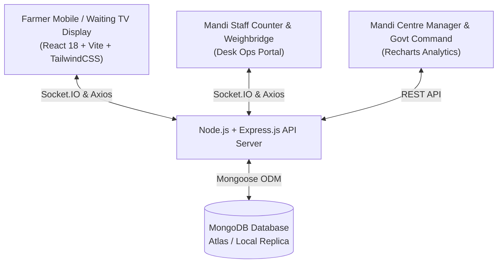
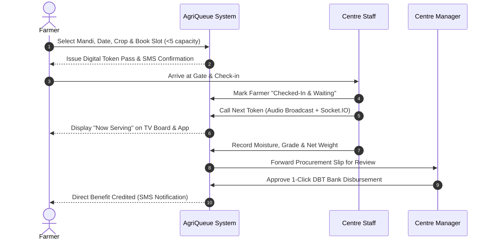

# 🌾 AgriQueue (KisanSetu)

> **Smart Agricultural MSP Procurement Slot Scheduling & Real-Time Queue Serialization System**  
> *Developed for Smart India Hackathon (SIH) 2026*  
> **Problem Statement & Focus:** Eliminating APMC Mandi Congestion, Fair Minimum Support Price (MSP) Allocation, Real-time Transparent Queue Tracking, and Rapid Direct Benefit Transfer (DBT) Disbursement.  
> **Department:** Department of Consumer Affairs, Ministry of Consumer Affairs, Food & Public Distribution (Govt. of India).

---

## 📌 Table of Contents
- [Problem Overview](#-the-problem-at-apmc-mandis)
- [Key Features & Solution](#-key-features--solution)
- [Architecture & Tech Stack](#-architecture--tech-stack)
- [Role-Based Access Control (RBAC)](#-role-based-access-control-rbac)
- [Interactive Workflows](#-interactive-workflows)
- [Database Schema (MongoDB)](#-database-schema-mongodb)
- [Installation & Setup](#-installation--setup)
- [Demo Credentials](#-demo-credentials)
- [Repository Structure](#-repository-structure)
- [Team & Acknowledgements](#-team--acknowledgements)

---

## 🚨 The Problem at APMC Mandis

During peak harvest seasons (Rabi & Kharif), thousands of farmers transport tractor-trolleys to APMC mandis unannounced:
1. **Severe Traffic Congestion:** Mandi approaches suffer 3–5 km gridlocks lasting over 24–48 hours.
2. **Prolonged Waiting & Harvest Deterioration:** Farmers wait in severe weather, causing grain spoilage, weight loss, and distress sales below MSP.
3. **Middlemen Exploitation:** Unregistered queue lines allow middlemen and brokers to manipulate turn orders.
4. **Manual Record Delays:** Paper-based grading and manual weighbridge chits delay Direct Benefit Transfer (DBT) payments by weeks.

---

## 💡 Key Features & Solution

**AgriQueue (KisanSetu)** transforms harvest intake into a predictable, serialized digital workflow:

- 🗓️ **Guaranteed Slot Booking with Strict Capacity Control:** Farmers reserve 2-hour appointment slots (`08:00-10:00`, `10:00-12:00`, etc.) based on daily mandi limits and vehicle size (strictly max 5 farmers per slot to prevent overcrowding).
- 🎫 **Digital Gate Token & Check-In:** Farmers receive automated SMS alerts and a digital QR token pass upon physical arrival at the mandi gate.
- 📡 **Live WebSocket Queue Streaming:** Real-time synchronized counter display boards powered by **Socket.IO** broadcast current token inspection updates to waiting sheds and public display TVs.
- 🗺️ **Interactive Geographic Mandi Explorer:** High-performance Leaflet & OpenStreetMap locator pinpointing operational mandis across Indian states with daily capacity, real coordinates, and crop support.
- ⚖️ **Electronic Weighment & Instant MSP Assessment:** Mandi staff records moisture content, quality grades (Grade A / Standard), and gross/tare weights with automated MSP price computation.
- 💳 **1-Click DBT Approval & PFMS Integration:** Mandi managers verify inspection chits with single-click DBT authorizations directly tied to the farmer's verified bank account and Aadhaar.
- 🌐 **Multilingual & Rural-Optimized UI:** High-contrast, mobile-first design with instantaneous Hindi (हिन्दी) and English language localization.

---

## 🏗️ Architecture & Tech Stack



### Frontend
- **React 18** (Vite bundler) for rapid rendering and low-latency interaction.
- **TailwindCSS** for responsive, mobile-first government design system aesthetics.
- **Socket.IO Client** for real-time bi-directional token updates.
- **Leaflet & React-Leaflet** for interactive national mandi GIS mapping.
- **Recharts** for district and crop procurement analytical charts.
- **i18next & react-i18next** for localized language switching.
- **Lucide React** for modern, high-clarity government icons.

### Backend
- **Node.js (ES Modules) & Express.js** for high-throughput REST APIs.
- **Socket.IO Server** with room-based broadcast subscriptions per mandi centre (`joinCentreRoom`).
- **MongoDB & Mongoose ODM** for flexible, transactional document modeling.
- **JWT (JSON Web Tokens) & BcryptJS** for stateless, encrypted role authorization.

---

## 👥 Role-Based Access Control (RBAC)

| Role | Access Level | Primary Dashboard Capabilities |
| :--- | :--- | :--- |
| **🌾 Farmer** | Public & Authenticated | Book procurement slot, view live queue position, download digital token pass, check DBT payment records. |
| **📋 Centre Staff** | Counter Operator | Verify gate check-in, call next token with audio/visual trigger, enter moisture & weighbridge data. |
| **🏢 Centre Manager**| Mandi Supervisor | Real-time queue supervision, emergency slot capacity adjustment, 1-click DBT payment sign-off. |
| **🏛️ Govt Admin** | National Oversight | Macro-level state-wise procurement analytics, crop MSP disbursement charts, mandi master registry. |

---

## 🔄 Interactive Workflows

### 1. The 4-Stage Procurement Pipeline


---

## 🗄️ Database Schema (MongoDB)

AgriQueue models real APMC operations across 7 synchronized collections:

- **`Centres`**: Mandi names, GPS latitude/longitude, daily capacity in quintals, operating state/district, and supported MSP crops.
- **`Slots`**: Shift-wise windows (`08:00-10:00`, etc.), daily capacity, booked quantity, and strict 5-farmer booking limits.
- **`Users`**: Encrypted credentials, role identifiers (`farmer`, `staff`, `manager`, `admin`), Aadhaar details, land area, and bank account info for DBT.
- **`ProcurementBookings`**: Generated tokens (e.g. `TOK-KNL01-20260912-001`), status lifecycle (`booked` &rarr; `checkedIn` &rarr; `called` &rarr; `completed`), and assigned slot.
- **`ProcurementRecords`**: Moisture %, foreign matter %, quality grade (Grade A / Standard), gross weight, tare weight, net weight, and total MSP payment amount.
- **`PaymentRecords`**: PFMS transaction reference ID, payment mode (DBT/NEFT), status (`initiated` &rarr; `processing` &rarr; `completed`), and manager sign-off timestamp.
- **`Notifications`**: Real-time SMS and in-app updates dispatched on slot confirmation, queue calling, and payment processing.

---

## 🚀 Installation & Setup

### Prerequisites
- **Node.js** `>= 18.x`
- **MongoDB** (Local instance or MongoDB Atlas URI)
- **npm** or **yarn**

### 1. Clone the Repository
```bash
git clone https://github.com/virang01/AgriQueue_SIH_2026.git
cd AgriQueue_SIH_2026
```

### 2. Backend Setup
```bash
cd backend
npm install
```

Create a `.env` file in `backend/`:
```env
PORT=5000
MONGODB_URI=mongodb://127.0.0.1:27017/agriqueue
JWT_SECRET=your_super_secret_jwt_key
CLIENT_URL=http://localhost:3000
```

Seed initial mandi centres, demo users, time slots, and queue state:
```bash
npm run seed
```

Start the backend server:
```bash
# Development mode with watch:
npm run dev
# Or production start:
npm start
```
*Backend runs on `http://localhost:5000`.*

### 3. Frontend Setup
Open a new terminal window:
```bash
cd ../frontend
npm install
npm run dev
```
*Frontend runs on `http://localhost:3000`.*

---

## 🔑 Demo Credentials

To test the application across all roles without manual registration, use the instant one-click login buttons or credentials below:

| Role | Phone | Password | Assigned Centre | Primary Test Action |
| :--- | :--- | :--- | :--- | :--- |
| **🌾 Farmer (Suresh Patel)** | `9876543211` | `password123` | Karnal APMC (`KNL01`) | Book slots at `/book-slot`, view token pass |
| **📋 Centre Staff (Vikas Kumar)** | `7777777777` | `password123` | Karnal APMC (`KNL01`) | Call next token, submit weighbridge data |
| **🏢 Mandi Manager (Amarjit Singh)**| `8888888888` | `password123` | Karnal APMC (`KNL01`) | Sign off DBT payment, live queue overview |
| **🏛️ Govt Admin (Dr. Sharma)** | `9999999999` | `password123` | National Headquarters | Review national procurement analytics |

---

## 📁 Repository Structure

```text
AgriQueue_SIH_2026/
├── backend/
│   ├── src/
│   │   ├── config/             # DB connection & environment variables
│   │   ├── controllers/        # Auth, Booking, Centre, Queue, & Payment logic
│   │   ├── middleware/         # JWT verification, Role authorization, Error handler
│   │   ├── models/             # Mongoose schemas (User, Centre, Booking, Slot, etc.)
│   │   ├── routes/             # RESTful API route declarations
│   │   └── app.js              # Express app setup & route binding
│   ├── seed.js                 # Database seeder with realistic demo mandis & tokens
│   ├── server.js               # HTTP & Socket.IO server initialization
│   └── package.json
├── frontend/
│   ├── public/                 # Favicons and static assets
│   ├── src/
│   │   ├── assets/             # AgriQueue logos and icons
│   │   ├── components/         # Navbar, Footer, MandiMap, NotificationToast, etc.
│   │   ├── context/            # AuthContext & SocketContext (real-time state)
│   │   ├── i18n/               # English & Hindi translation files
│   │   ├── pages/              # Home, Login, Register, BookSlot, LiveQueue, Dashboards
│   │   ├── App.jsx             # Main router & layout structure
│   │   ├── index.css           # Tailwind directives, animations & design system tokens
│   │   └── main.jsx            # React root mount
│   ├── index.html
│   ├── tailwind.config.js      # Custom government color palette & font configuration
│   ├── vite.config.js          # Vite config & API proxy bindings
│   └── package.json
├── DATABASE_EXPLANATION_FOR_PROFESSOR.md  # Detailed schema presentation walkthrough
├── PROJECT_PRESENTATION_WORKFLOW.md      # Live demo presentation script for evaluators
├── TECH_STACK.md                        # Technical component documentation
└── README.md                            # Comprehensive project overview
```

---

## 🤝 Team & Acknowledgements

- **Team Name:** Cipher6  
- **Event:** Smart India Hackathon (SIH) 2026  
- **Guidance & Inspiration:** Department of Consumer Affairs, Government of India  
- **Mission:** Empowering Indian farmers with transparent, predictable, and dignified agricultural procurement.